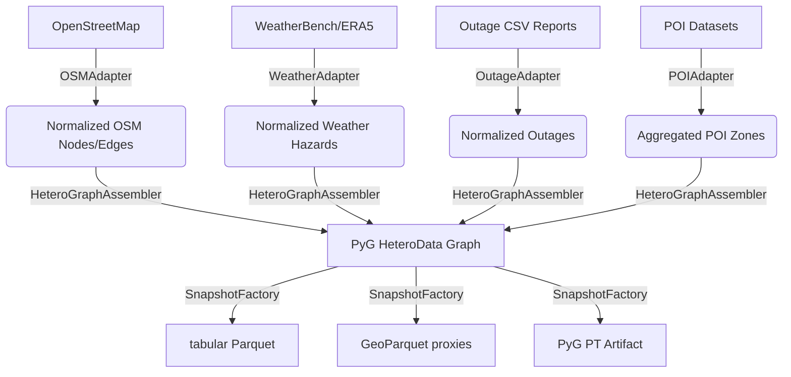

# Data Dictionary and Lineage

This document describes the schema specifications, structural dependencies, retention policies, and license attributes of the AetherGrid-Sovereign data plane.

## Data Lineage Flow

---

## Data Dictionary

### Nodes
- **`road_segment`**: Spatial network vertices representing streets and paths.
  - Features: coordinate projections (UTM x, y), speed limit, capacity.
- **`power_node`**: Electric infrastructure substations or transformer junctions.
  - Features: coordinates, capacity limit proxy.
- **`poi_social_node`**: Binned POI aggregates representing community zones.
  - Features: category occurrence counts, aggregate vulnerability index.
- **`weather_station`**: Spatial weather cell anchors.
  - Features: temperature, wind speed.

### Edges
- **`powers`** (`power_node` -> `poi_social_node`): Electrical supply dependencies.
  - Attributes: $\mu$, $\nu$ fuzzy confidence coefficients.
- **`connects`** (`road_segment` -> `poi_social_node`): Spatial accessibility links.
  - Attributes: distance weight.

---

## Data Governance & Retention Policies

- **Retention Window**: Active project data is retained for 180 days. Long-term training snapshots are archived in immutable, content-addressed storage.
- **Sensitivity Policy**: High sensitivity infrastructure data (such as exact transmission line routing) must be sanitized and generalized prior to public code release.
- **Anonymization**: Individual coordinates are perturbed to a minimum grid bin spacing of 10 meters to protect privacy.

---

## License Registry

- **OpenStreetMap**: ODbL (Open Database License)
- **WeatherBench**: CC BY 4.0
- **Outage Fixture**: Apache 2.0 (Synthetic fixture)
