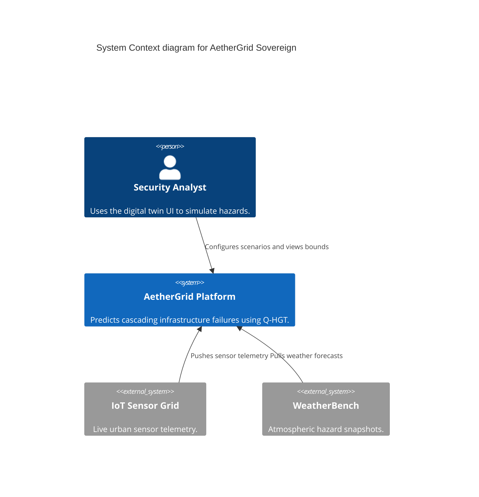
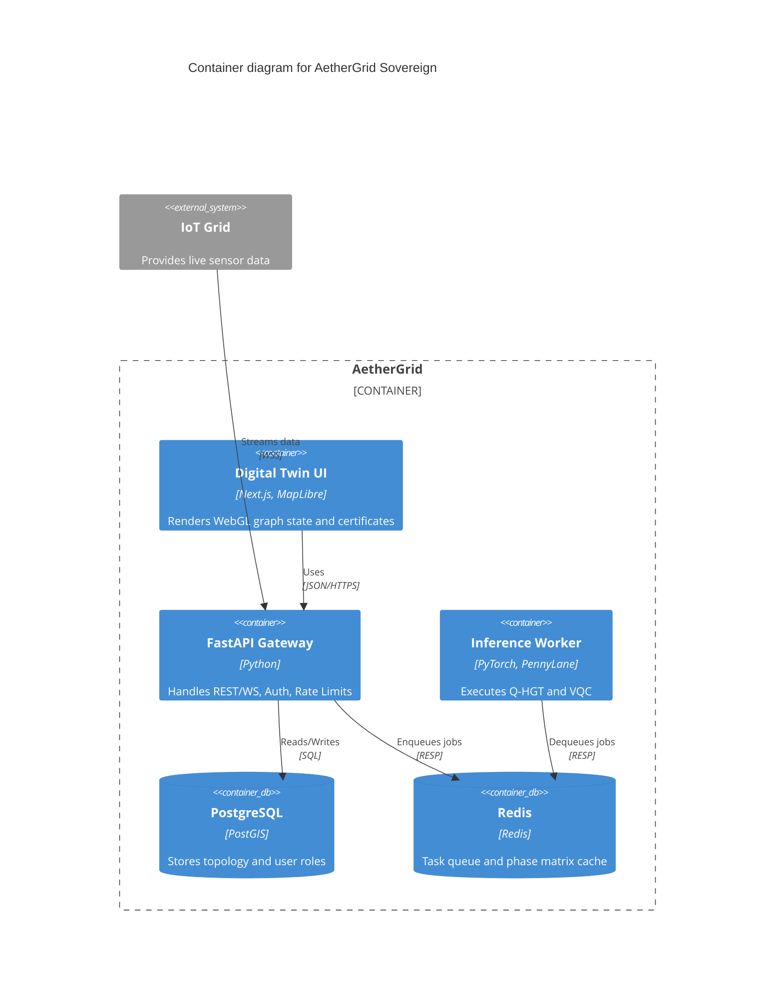

# Architecture & Data Flow

```mermaid
C4Context
  title System Context diagram for AetherGrid Sovereign

  Person(analyst, "Security Analyst", "Uses the digital twin UI to simulate hazards.")
  System(aethergrid, "AetherGrid Platform", "Predicts cascading infrastructure failures using Q-HGT.")
  
  System_Ext(iot_grid, "IoT Sensor Grid", "Live urban sensor telemetry.")
  System_Ext(weather_api, "WeatherBench", "Atmospheric hazard snapshots.")

  Rel(analyst, aethergrid, "Configures scenarios and views bounds")
  Rel(iot_grid, aethergrid, "Pushes sensor telemetry")
  Rel(weather_api, aethergrid, "Pulls weather forecasts")
```

```mermaid
C4Container
  title Container diagram for AetherGrid Sovereign

  System_Ext(iot, "IoT Grid", "Provides live sensor data")
  
  Container_Boundary(c1, "AetherGrid") {
    Container(ui, "Digital Twin UI", "Next.js, MapLibre", "Renders WebGL graph state and certificates")
    Container(api, "FastAPI Gateway", "Python", "Handles REST/WS, Auth, Rate Limits")
    Container(worker, "Inference Worker", "PyTorch, PennyLane", "Executes Q-HGT and VQC")
    ContainerDb(db, "PostgreSQL", "PostGIS", "Stores topology and user roles")
    ContainerDb(redis, "Redis", "Redis", "Task queue and phase matrix cache")
  }

  Rel(ui, api, "Uses", "JSON/HTTPS")
  Rel(api, db, "Reads/Writes", "SQL")
  Rel(api, redis, "Enqueues jobs", "RESP")
  Rel(worker, redis, "Dequeues jobs", "RESP")
  Rel(iot, api, "Streams data", "WSS")
```
