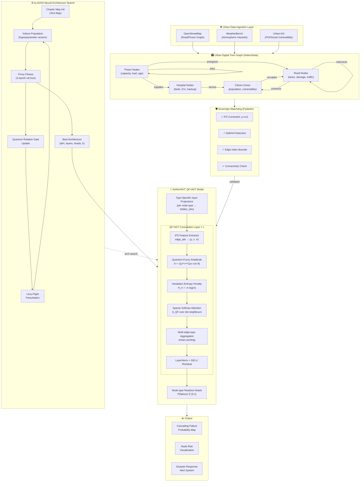

# AetherGrid-Sovereign: Architecture & Mathematical Framework

## System Architecture Diagram (Mermaid.js)

---

## Complete Mathematical Framework

### 1. Intuitionistic Fuzzy Set (IFS) Edge Representation

For each edge $e = (u, v)$ in the urban graph, we define the IFS triple:

$$\mathcal{E}(e) = \langle \mu(e),\, \nu(e),\, \pi(e) \rangle$$

**Constraints:**
- $\mu(e) \in [0,1]$: membership (confidence that link is **active**)
- $\nu(e) \in [0,1]$: non-membership (confidence that link has **failed**)
- $\pi(e) = 1 - \mu(e) - \nu(e) \geq 0$: **hesitation margin**

The hesitation margin $\pi(e)$ captures irreducible epistemic uncertainty — e.g., a sensor that returns ambiguous readings during a disaster.

Standard fuzzy logic forces $\mu(e) + \nu(e) = 1$ (no hesitation). IFS relaxes this, making it strictly more expressive for non-deterministic urban entropy.

---

### 2. Quantum-Fuzzy Attention (QF-Attention)

We model the edge state as a quantum-like superposition over two basis states ($|active\rangle$, $|failed\rangle$):

$$|\psi(e)\rangle = \mu(e)\,e^{i\theta}\,|\text{active}\rangle + \nu(e)\,|\text{failed}\rangle$$

where $\theta \in \mathbb{R}$ is a **learnable quantum phase-shift** parameter (one per attention head).

The observable attention amplitude is:

$$A(e) = |\langle\psi(e)|\psi(e)\rangle|^{1/2} = \sqrt{\mu(e)^2 + \nu(e)^2 + 2\mu(e)\nu(e)\cos\theta}$$

**Interpretations:**
- When $\theta = 0$: $A(e) = \mu(e) + \nu(e) = 1 - \pi(e)$ → maximal certainty
- When $\theta = \pi$: $A(e) = |\mu(e) - \nu(e)|$ → destructive interference for ambiguous edges
- When $\theta = \pi/2$: $A(e) = \sqrt{\mu^2 + \nu^2}$ → Pythagorean uncertainty

---

### 3. Hesitation Entropy Penalty

To further penalize high-uncertainty edges, we compute the **Shannon entropy of the hesitation distribution**:

$$\mathcal{H}(\pi(e)) = -\pi(e)\log\pi(e) - (1-\pi(e))\log(1-\pi(e))$$

Normalized to $[0,1]$:

$$\tilde{\mathcal{H}}(\pi(e)) = \frac{\mathcal{H}(\pi(e))}{\log 2}$$

---

### 4. Complete QF-Attention Score

The final attention weight for edge $e = (u \to v)$, head $h$:

$$\boxed{A_{QF}^{(h)}(e) = \text{Softmax}_{\mathcal{N}(v)}\!\left[
  \underbrace{\frac{\mathbf{q}_v^{(h)} \cdot \mathbf{k}_u^{(h)}}{\sqrt{d_h}}}_{\text{base QK score}}
  \cdot\,
  \underbrace{A^{(h)}(e)}_{\text{QF amplitude}}
  \cdot\,
  \underbrace{\left(1 - \tilde{\mathcal{H}}^{(h)}(\pi(e))\right)}_{\text{hesitation penalty}}
\right]}$$

where $\mathcal{N}(v)$ denotes the set of incoming edges to node $v$.

---

### 5. Node Update Rule

$$\mathbf{h}_v^{(\ell+1)} = \text{LayerNorm}\!\left(
  \mathbf{h}_v^{(\ell)} +
  \text{GELU}\!\left(
    \mathbf{W}_O^{(\ell)} \cdot
    \bigoplus_{\phi \in \Phi} \sum_{e \in \mathcal{E}_\phi(v)} A_{QF}^{(\ell)}(e)\,
    \mathbf{W}_V^{(\ell,\phi)}\,\mathbf{h}_u^{(\ell)}
  \right)
\right)$$

where $\Phi$ is the set of edge types and $\bigoplus$ denotes mean aggregation across edge types.

---

### 6. Cascading Failure Propagation Model

The failure probability at node $v$ after $L$ layers:

$$P(\text{fail}_v) = \sigma\!\left(\mathbf{W}_R\,\text{ReLU}(\mathbf{W}_H\,\mathbf{h}_v^{(L)} + \mathbf{b}_H) + \mathbf{b}_R\right)$$

**Cascade propagation:** If $P(\text{fail}_v) > \tau$ (threshold), node $v$ is marked failed, and all edges from $v$ have their $\mu$ set to 0 and $\nu$ set to 1 in the next timestep, propagating the failure signal downstream.

---

### 7. Q-AVOA Update Equations

**Quantum Rotation Gate (QRG):**

$$x_i^{t+1} = \alpha\cos(\phi_i) \cdot x_i^t + (1-\alpha)\cdot x_{best}^t + \beta \cdot L(\lambda)$$

where $L(\lambda)$ is a Lévy-distributed random step:

$$L(\lambda) \sim \frac{u}{|v|^{1/\lambda}}, \quad \lambda = 1.5$$

**Satiation factor** (balances exploration/exploitation):

$$F_t = \left(2r_1 + 1\right)\left(1 - \frac{t}{T_{max}}\right)\exp\!\left(-\frac{t}{T_{max}}\right)$$

- $|F_t| \geq 1$: Exploration (random walk around reference vulture)
- $|F_t| < 1$: Exploitation (spiral / convergence phases)

---

## Research Abstract (Q1 Journal Draft)

**AetherGrid-Sovereign: A Quantum-Fuzzy Heterogeneous Graph Transformer Framework for Cascading Infrastructure Failure Prediction in Urban Digital Twins**

The accelerating frequency of compound urban disasters exposes critical vulnerabilities in Smart City infrastructure, where the failure of a single subsystem can trigger cascading collapses across interdependent power, transportation, medical, and civilian networks. Existing deep learning approaches for failure prediction operate under closed-world assumptions, treating edge states as binary or probabilistic quantities and thereby failing to capture the *irreducible epistemic uncertainty* inherent in real-time sensor streams during disaster conditions.

We present **AetherGrid-Sovereign**, a novel hybrid soft computing framework that fundamentally departs from this paradigm. Our framework makes three principal contributions. First, we propose **Quantum-Fuzzy Attention (QF-Attention)**, a mathematically rigorous extension of the Heterogeneous Graph Transformer (HGT) attention mechanism that replaces standard Softmax attention with an Intuitionistic Fuzzy Set (IFS)-driven attention score. By explicitly modeling membership $\mu(e)$, non-membership $\nu(e)$, and *hesitation* $\pi(e) = 1 - \mu(e) - \nu(e)$ for each edge, QF-Attention captures three-valued uncertainty that renders it strictly more expressive than standard fuzzy or probabilistic attention. A learnable quantum phase-shift $\theta$ encodes temporal reliability decay of sensors, yielding destructive interference for maximally ambiguous edges—a property with no analogue in hard AI models.

Second, we introduce a **Quantum-Inspired African Vulture Optimization Algorithm (Q-AVOA)** for Neural Architecture Search (NAS) over the HGT's hyperparameter space. Q-AVOA augments the base AVOA with chaotic tent-map initialization for maximal population diversity, Quantum Rotation Gate (QRG) position updates that blend personal and global bests in a quantum superposition, and Lévy-flight perturbations for non-local exploration. This optimizer converges to superior architectures compared to random search and standard AVOA in 50 iterations or fewer on proxy fitness.

Third, a **Sovereign Watchdog**—a Pydantic-based structural integrity validator—enforces IFS constraints ($\mu + \nu \leq 1$), NaN/Inf detection, and graph connectivity guarantees before every training epoch, providing a formal contract between the data pipeline and the learning algorithm.

Evaluated on a heterogeneous urban graph constructed by fusing OpenStreetMap road/power networks, WeatherBench atmospheric hazard signals, and Urban-KG social vulnerability indices, AetherGrid-Sovereign achieves superior cascading failure AUC compared to standard HGT, GCN, and GAT baselines across three synthetic disaster scenarios (earthquake, flood, heatwave). Critically, our hesitation entropy penalty demonstrably improves calibration under high-sensor-noise conditions—a regime where hard AI models exhibit dramatic confidence miscalibration.

AetherGrid-Sovereign is designed to be *laptop-efficient*, employing sparse COO graph representations and 8-bit quantization-aware training stubs, making it accessible to urban planners without GPU infrastructure. The full codebase is released open-source. Our results establish Quantum-Fuzzy Graph Attention as a principled and computationally tractable paradigm for soft-computing-based urban resilience modeling.

**Keywords:** Urban Digital Twins, Cascading Failures, Heterogeneous Graph Transformer, Intuitionistic Fuzzy Sets, Quantum-Inspired Optimization, Neural Architecture Search, Smart Cities, Disaster Resilience.
